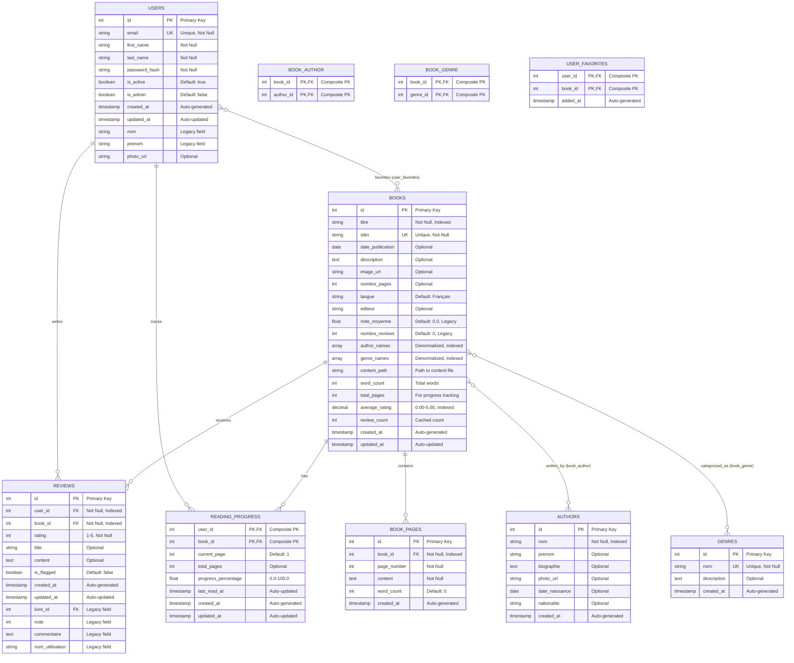

# BookLook Database Diagram

## Entity Relationship Diagram (ERD)



## Table Relationships Summary

### One-to-Many Relationships

1. **USERS → REVIEWS** (1:N)
   - One user can write many reviews
   - Each review belongs to one user
   - Cascade delete: When user is deleted, their reviews are deleted

2. **USERS → READING_PROGRESS** (1:N)
   - One user can track progress for many books
   - Each progress record belongs to one user
   - Cascade delete: When user is deleted, their progress is deleted

3. **BOOKS → REVIEWS** (1:N)
   - One book can have many reviews
   - Each review is for one book
   - Cascade delete: When book is deleted, its reviews are deleted

4. **BOOKS → READING_PROGRESS** (1:N)
   - One book can have many progress records (from different users)
   - Each progress record is for one book
   - Cascade delete: When book is deleted, all progress records are deleted

5. **BOOKS → BOOK_PAGES** (1:N)
   - One book can have many pages
   - Each page belongs to one book
   - Cascade delete: When book is deleted, all its pages are deleted
   - Unique constraint: (book_id, page_number)

### Many-to-Many Relationships

1. **BOOKS ↔ AUTHORS** (N:M via BOOK_AUTHOR)
   - One book can have multiple authors
   - One author can write multiple books
   - Junction table: `book_author`

2. **BOOKS ↔ GENRES** (N:M via BOOK_GENRE)
   - One book can belong to multiple genres
   - One genre can contain multiple books
   - Junction table: `book_genre`

3. **USERS ↔ BOOKS** (N:M via USER_FAVORITES)
   - One user can favorite multiple books
   - One book can be favorited by multiple users
   - Junction table: `user_favorites`

## Database Indexes

### Primary Indexes (Automatic)
- All `id` columns are primary keys with automatic indexes
- Composite primary keys on junction tables

### Performance Indexes

#### USERS Table
```sql
CREATE INDEX idx_users_email ON users(email);
CREATE INDEX idx_users_active ON users(is_active);
```

#### BOOKS Table
```sql
-- Basic indexes
CREATE INDEX idx_books_titre ON books(titre);
CREATE INDEX idx_books_isbn ON books(isbn);
CREATE INDEX idx_books_publication ON books(date_publication);

-- Full-text search (GIN indexes)
CREATE INDEX idx_books_titre_gin ON books USING gin(to_tsvector('english', titre));
CREATE INDEX idx_books_authors_gin ON books USING gin(author_names);
CREATE INDEX idx_books_genres_gin ON books USING gin(genre_names);

-- Sorting indexes
CREATE INDEX idx_books_rating ON books(average_rating DESC);
CREATE INDEX idx_books_review_count ON books(review_count DESC);
```

#### REVIEWS Table
```sql
CREATE INDEX idx_reviews_user ON reviews(user_id);
CREATE INDEX idx_reviews_book ON reviews(book_id);
CREATE INDEX idx_reviews_rating ON reviews(rating);
CREATE INDEX idx_reviews_created ON reviews(created_at DESC);
```

#### READING_PROGRESS Table
```sql
CREATE INDEX idx_reading_progress_user ON reading_progress(user_id);
CREATE INDEX idx_reading_progress_last_read ON reading_progress(last_read_at DESC);
CREATE INDEX idx_reading_progress_percentage ON reading_progress(progress_percentage);
```

## Database Triggers

### Automatic Rating Updates

When a review is created, updated, or deleted, the book's rating statistics are automatically recalculated:

```sql
-- Trigger function
CREATE OR REPLACE FUNCTION update_book_rating_stats()
RETURNS TRIGGER AS $$
BEGIN
    UPDATE books
    SET 
        average_rating = (SELECT AVG(rating) FROM reviews WHERE book_id = NEW.book_id),
        review_count = (SELECT COUNT(*) FROM reviews WHERE book_id = NEW.book_id),
        updated_at = NOW()
    WHERE id = NEW.book_id;
    RETURN NEW;
END;
$$ LANGUAGE plpgsql;

-- Triggers
CREATE TRIGGER trigger_update_book_rating_on_insert
AFTER INSERT ON reviews
FOR EACH ROW
EXECUTE FUNCTION update_book_rating_stats();
```

### Automatic Timestamp Updates

All tables with `updated_at` columns automatically update the timestamp on modification:

```sql
CREATE TRIGGER trigger_users_updated_at
BEFORE UPDATE ON users
FOR EACH ROW
EXECUTE FUNCTION update_updated_at_column();
```

## Database Views

### v_books_full
Complete book information with aggregated author and genre data:
```sql
SELECT * FROM v_books_full WHERE id = 1;
```

### v_user_reading_stats
User reading statistics including books started, finished, favorites, and reviews:
```sql
SELECT * FROM v_user_reading_stats WHERE user_id = 1;
```

### v_book_stats
Book statistics including ratings, favorites, and reader counts:
```sql
SELECT * FROM v_book_stats ORDER BY average_rating DESC LIMIT 10;
```

## Data Types Reference

| Column Type | PostgreSQL Type | Description |
|-------------|----------------|-------------|
| id | SERIAL | Auto-incrementing integer |
| email | VARCHAR(255) | Email address |
| password_hash | VARCHAR(255) | Hashed password |
| titre | VARCHAR(500) | Book title |
| isbn | VARCHAR(20) | ISBN number |
| description | TEXT | Long text content |
| rating | INTEGER | 1-5 star rating |
| average_rating | NUMERIC(3,2) | Precise rating (0.00-5.00) |
| progress_percentage | FLOAT | 0.0-100.0 percentage |
| author_names | TEXT[] | Array of strings |
| genre_names | TEXT[] | Array of strings |
| created_at | TIMESTAMP WITH TIME ZONE | Auto-generated timestamp |
| updated_at | TIMESTAMP WITH TIME ZONE | Auto-updated timestamp |

## Constraints

### Check Constraints
- `reviews.rating`: Must be between 1 and 5
- `reading_progress.progress_percentage`: Must be between 0 and 100

### Unique Constraints
- `users.email`: Each email must be unique
- `books.isbn`: Each ISBN must be unique
- `genres.nom`: Each genre name must be unique
- `reviews(user_id, book_id)`: One review per user per book

### Foreign Key Constraints
All foreign keys use `ON DELETE CASCADE` to maintain referential integrity:
- When a user is deleted, all their reviews, progress, and favorites are deleted
- When a book is deleted, all its reviews, progress records, and associations are deleted

## Sample Queries

### Get Top Rated Books
```sql
SELECT * FROM books 
WHERE review_count >= 5 
ORDER BY average_rating DESC 
LIMIT 10;
```

### Search Books by Genre
```sql
SELECT * FROM books 
WHERE 'Fiction' = ANY(genre_names)
ORDER BY average_rating DESC;
```

### Get User's Reading Progress
```sql
SELECT b.titre, rp.progress_percentage, rp.last_read_at
FROM reading_progress rp
JOIN books b ON rp.book_id = b.id
WHERE rp.user_id = 1
ORDER BY rp.last_read_at DESC;
```

### Get Book Reviews with User Info
```sql
SELECT r.rating, r.title, r.content, u.first_name, u.last_name, r.created_at
FROM reviews r
JOIN users u ON r.user_id = u.id
WHERE r.book_id = 1
ORDER BY r.created_at DESC;
```

### Get User's Favorite Books
```sql
SELECT b.*, uf.added_at
FROM books b
JOIN user_favorites uf ON b.id = uf.book_id
WHERE uf.user_id = 1
ORDER BY uf.added_at DESC;
```

## Performance Optimization

### Denormalized Fields
To improve query performance for large datasets:
- `books.author_names`: Array of author names (avoids JOIN with authors table)
- `books.genre_names`: Array of genre names (avoids JOIN with genres table)
- `books.average_rating`: Cached average rating (avoids aggregation on reviews)
- `books.review_count`: Cached review count (avoids COUNT on reviews)

### GIN Indexes
For fast array and full-text searches:
- `idx_books_authors_gin`: Fast search in author_names array
- `idx_books_genres_gin`: Fast search in genre_names array
- `idx_books_titre_gin`: Full-text search on book titles

### Composite Indexes
For common query patterns:
- `(user_id, book_id)` on reviews: Fast lookup of user's review for a book
- `(user_id, book_id)` on reading_progress: Fast lookup of user's progress for a book

## Database Size Estimates

For the Institutional Books 1.0 dataset (>300GB):

| Table | Estimated Rows | Estimated Size |
|-------|---------------|----------------|
| books | 1,000,000+ | 50-100 GB |
| authors | 100,000+ | 5-10 GB |
| genres | 1,000+ | < 1 GB |
| users | 100,000+ | 5-10 GB |
| reviews | 5,000,000+ | 20-50 GB |
| reading_progress | 1,000,000+ | 10-20 GB |
| book_author | 2,000,000+ | 5-10 GB |
| book_genre | 3,000,000+ | 5-10 GB |
| user_favorites | 500,000+ | 5-10 GB |

**Total Estimated Size**: 100-200 GB (excluding book content files)

## Maintenance Queries

### Analyze Tables
```sql
ANALYZE users;
ANALYZE books;
ANALYZE reviews;
ANALYZE reading_progress;
```

### Vacuum Tables
```sql
VACUUM ANALYZE users;
VACUUM ANALYZE books;
VACUUM ANALYZE reviews;
```

### Check Index Usage
```sql
SELECT schemaname, tablename, indexname, idx_scan, idx_tup_read
FROM pg_stat_user_indexes
ORDER BY idx_scan DESC;
```

### Find Unused Indexes
```sql
SELECT schemaname, tablename, indexname
FROM pg_stat_user_indexes
WHERE idx_scan = 0
AND indexname NOT LIKE '%_pkey';
```
